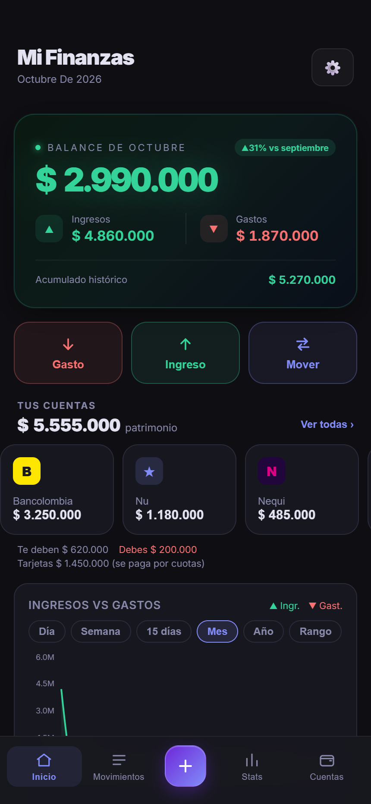
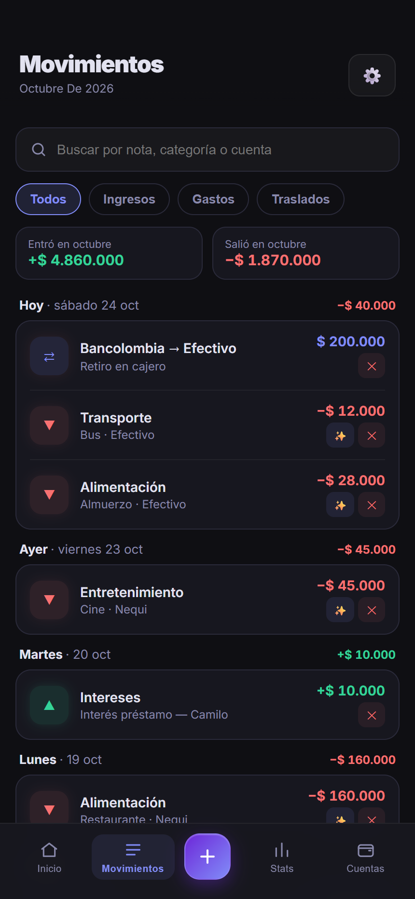
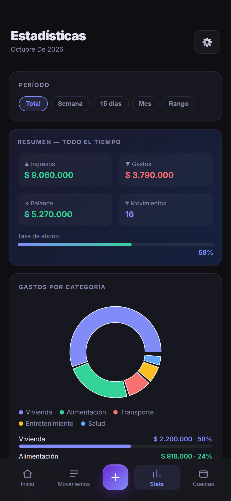
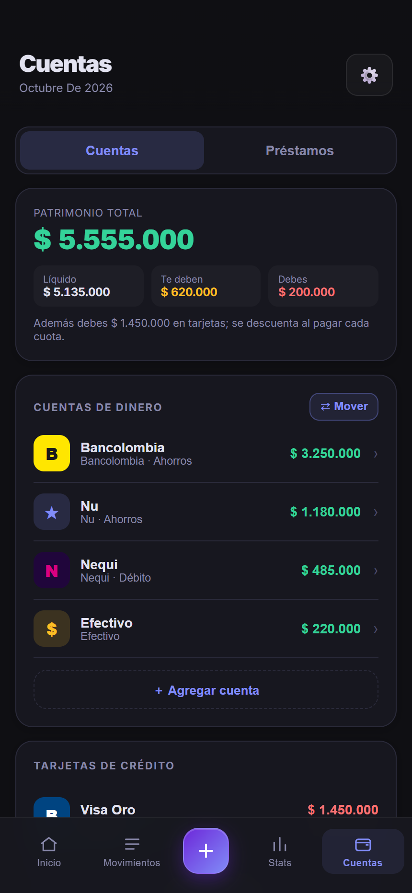
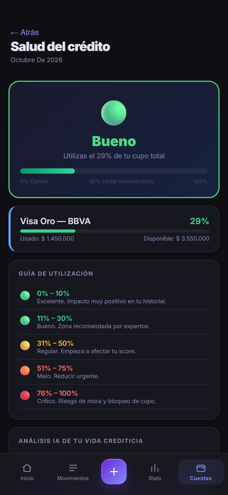
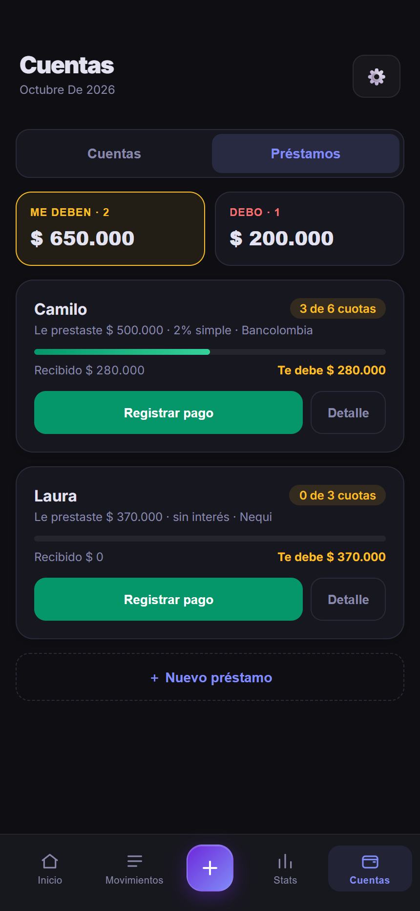
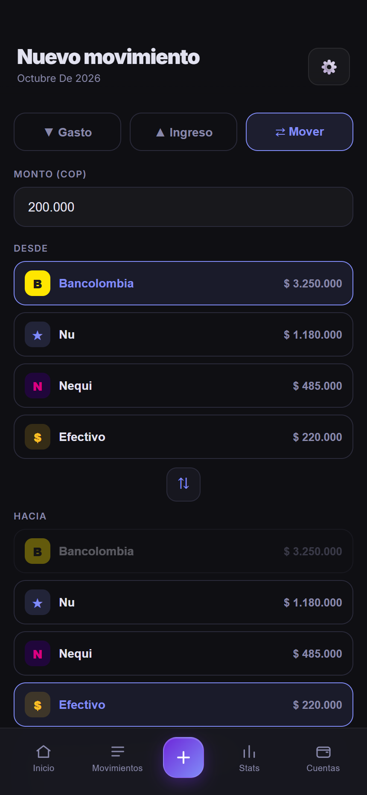

# Mis Finanzas

App personal de finanzas para Colombia: registra ingresos y gastos, controla tarjetas
y cupos, lleva préstamos y deudas, metas de ahorro y presupuestos. Todo se guarda
**en el dispositivo** — no hay servidor, ni cuentas, ni sincronización en la nube.

Hecha con **React + Vite** y empaquetada como app Android con **Capacitor**.

## Capturas

Los datos que se ven son de demostración.

| Inicio | Movimientos | Estadísticas |
|---|---|---|
|  |  |  |
| Balance del mes, acciones rápidas (gasto, ingreso, mover) y tus cuentas en carrusel. | Agrupados por día con su total neto, buscador y filtro de traslados. | Resumen, tasa de ahorro y reparto del gasto por categoría. |

| Cuentas y tarjetas | Salud del crédito | Préstamos |
|---|---|---|
|  |  |  |
| Patrimonio desglosado, saldos, cupos y cuotas pendientes. | Utilización del cupo, score estimado, guía por tramos y consejos. | Lo que te deben y lo que debes, con abonos parciales. |



**Mover fondos** — pasa plata entre tus propias cuentas (Bancolombia → Efectivo,
Nu → Nequi…) sin registrarlo como gasto ni ingreso. Valida el saldo de origen y
muestra cómo quedan las dos cuentas antes de confirmar. Gastos e ingresos se
registran en la misma pantalla, con categoría, cuenta (o reparto entre varias),
método de pago, nota y fecha.

<br clear="right">

## Funciones

- **Inicio** — balance del mes, acciones rápidas, carrusel de cuentas y gráfica de área con periodos (día, semana, 15 días, mes, año o rango personalizado).
- **Movimientos** — alta de ingresos/gastos con categoría, método de pago, fecha y cuenta de origen. Soporta **pago dividido** entre varias cuentas, validando fondos y cupo disponible. El historial se agrupa por día y tiene buscador.
- **Mover fondos** — traslados entre cuentas propias que no cuentan como ingreso ni gasto; se pueden deshacer desde Movimientos.
- **Cuentas y tarjetas** — débito, ahorros, efectivo y crédito, con logos de bancos y billeteras colombianas (Bancolombia, Nequi, Daviplata, Davivienda, BBVA, Banco de Bogotá, Occidente) o logo propio subido por el usuario.
- **Crédito** — utilización del cupo, score estimado y planes de compras a cuotas. Gastos recurrentes mensuales en Configuración.
- **Consejos** — análisis local por reglas sobre utilización, balance y categoría de mayor gasto, con sugerencia de qué tarjeta pagar primero. No usa ninguna API externa.
- **Préstamos y deudas** — en la misma pestaña que las cuentas: dinero que prestaste y dinero que te prestaron, con interés simple o compuesto, plazos y abonos parciales.
- **Metas, presupuestos y categorías** — personalizables.
- **Exportar / importar** — respaldo completo en JSON (restaurable) y movimientos en CSV para Excel, compartibles desde Android.

## Privacidad

Los datos viven solo en el teléfono: `localStorage` en web y **Capacitor Preferences**
(`SharedPreferences` nativo) en Android, que sobrevive a la limpieza de caché del WebView.
La app no hace peticiones de red; el único permiso Android es `INTERNET`, requerido por el WebView.

## Stack

| | |
|---|---|
| UI | React 19, Recharts, Inter (`@fontsource`) |
| Build | Vite 8 |
| Móvil | Capacitor 8 (`app`, `preferences`, `filesystem`, `share`, `status-bar`) |
| Lint | ESLint 10 |

## Desarrollo

```bash
npm install
npm run dev      # servidor de desarrollo
npm run build    # compila a dist/
npm run preview  # sirve dist/
npm run lint
```

Las capturas del README se regeneran con `scripts/capturas.mjs` (instrucciones al inicio del archivo).

## Android

```bash
npm run build
npx cap sync android
npx cap open android      # abre Android Studio
```

El **keystore de firma (`*.jks`) no está en el repositorio** y no debe subirse.
Guárdalo aparte junto con sus contraseñas; sin él no se pueden publicar
actualizaciones del mismo app ID (`com.andrey.finanzas`) en Play Store.

Los iconos y el splash se regeneran desde `assets/icon.png` y `assets/splash.png`:

```bash
npx @capacitor/assets generate --android
```

## Estructura

```
src/App.jsx     toda la app (vistas, estado, persistencia)
scripts/        utilidades de desarrollo (capturas del README)
src/*.css       estilos base y reset
assets/         icono y splash fuente para @capacitor/assets
android/        proyecto nativo generado por Capacitor
```
